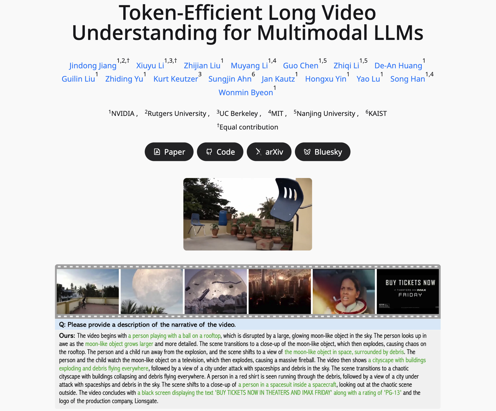

# STORM: Token-Efficient Long Video Understanding for Multimodal LLMs

## Abstract
Recent advances in video-based multimodal large language models (Video-LLMs) have significantly improved video understanding by processing videos as sequences of image frames. However, many existing methods treat frames independently in the vision backbone, lacking explicit temporal modeling, which limits their ability to capture dynamic patterns and efficiently handle long videos. To address these limitations, we introduce \method (\textcolor{blue}{\textbf{S}}patiotemporal \textcolor{blue}{\textbf{TO}}ken \textcolor{blue}{\textbf{R}}eduction for \textcolor{blue}{\textbf{M}}ultimodal LLMs), a novel architecture incorporating a dedicated temporal encoder between the image encoder and the LLM.  Our temporal encoder leverages the Mamba State Space Model to integrate temporal information into image tokens, generating enriched representations that preserve inter-frame dynamics across the entire video sequence. This enriched encoding not only enhances video reasoning capabilities but also enables effective token reduction strategies, including test-time sampling and training-based temporal and spatial pooling, substantially reducing computational demands on the LLM without sacrificing key temporal information. By integrating these techniques, our approach simultaneously reduces training and inference latency while improving performance, enabling efficient and robust video understanding over extended temporal contexts. Extensive evaluations show that \method achieves state-of-the-art results across various long video understanding benchmarks (more than 5\% improvement on MLVU and LongVideoBench) while reducing the computation costs by up to $8\times$ and the decoding latency by 2.4-2.9$\times$ for the fixed numbers of input frames.

